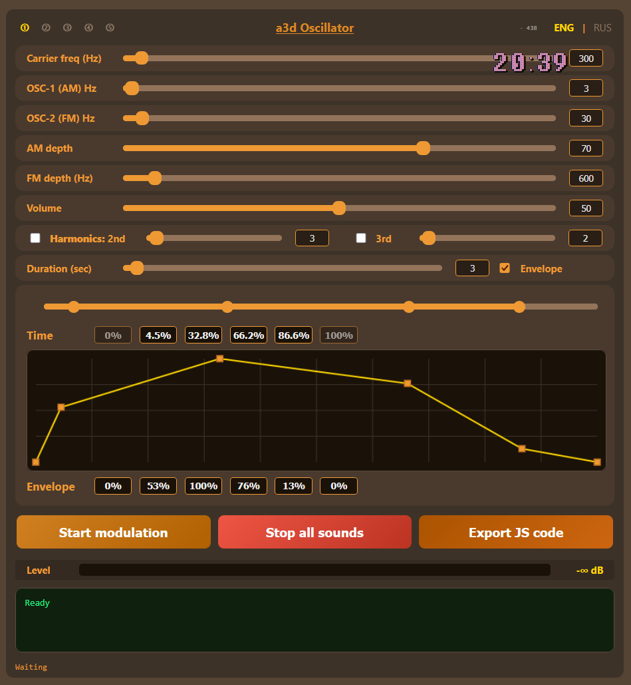

# a3d Oscillator

[ENG](#english) | [RUS](#русский)

## English

**a3d Oscillator** is a browser-based audio synthesizer for web developers and sound designers. It allows you to create custom sounds and export them as a JS synthesizer function for your HTML code.

### Key Features
- **Dual Oscillators:** AM and FM modulation with independent frequency and depth controls.
- **Harmonics:** Addition of 2nd and 3rd harmonics with individual gain.
- **Envelope:** Precise amplitude shaping over time using a 6-point curve.
- **One-Click Export:** Generates a standalone HTML/JS file with your sound. You can use it in your projects to add audio to dynamic HTML pages or canvas games.

### How to Use
1. Tweak the parameters (Carrier, Modulators, Envelope) to design your sound.
2. **Start modulation** to preview the result in the browser.
3. **Export JS code** to generate the standalone player script.
4. **Save to file** to download the `.html` file and integrate it into your project.

---

## Русский

**a3d Oscillator** — это браузерный синтезатор звука для веб-разработчиков и саунд-дизайнеров. Позволяет создать кастомный звук и экспортировать его в JS функцию-синтезатор для вашего html кода. 

### Главные возможности
- **Два осциллятора:** AM и FM модуляция с независимой настройкой частоты и глубины.
- **Гармоники:** Добавление 2-й и 3-й гармоник с индивидуальной громкостью.
- **Огибающая:** Точная настройка амплитуды звука во времени с помощью 6 точек на кривой.
- **Экспорт в один клик:** Генерация автономного HTML/JS файла с вашим звуком. Можете использовать его в своих проектах для озвучки динамических html страниц или игр на canvas.

### Как пользоваться
1. Настройте параметры (Несущая, Модуляторы, Огибающая) для создания звука.
2. **Start modulation**, чтобы прослушать результат в браузере.
3. **Export JS code**, чтобы сгенерировать автономный скрипт плеера.
4. **Save to file**, чтобы скачать `.html` файл и интегрировать его в свой проект.